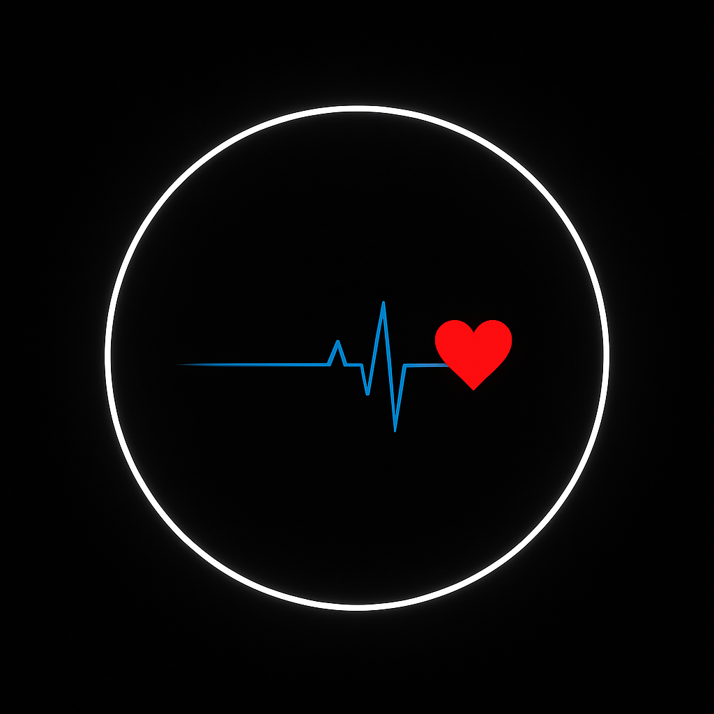

# 💓 Monitoramento Cardíaco com ESP32
## Monitor de Batimentos Cardíacos ❤️



Projeto de IoT que realiza a **leitura de batimentos cardíacos (BPM)** e **oxigenação sanguínea (SpO2)** utilizando um ESP32 com sensor MAX30100/30102, exibindo os dados via **interface web responsiva**.

---

## 🛠 Tecnologias Utilizadas

- ⚙️ **ESP32**
- 📡 Wi-Fi embutido
- 📊 Sensor de Pulso MAX30100/30102 ( Coletando dados neste protótipo)
- 🌐 Interface Web com HTML, CSS e JavaScript
- 📦 Servidor Web interno via `WebServer.h`

---
## 👀 Visão do produto
    Para pessoas que necessitam de monitoramento constante da saúde cardiovascular, o SystemBPM (Sistema de Batimento Cardíaco) é uma API destinada ao acompanhamento de ritmos cardíacos, que melhora a conscientização dos pacientes sobre sua saúde, auxiliando no monitoramento dos batimentos cardíacos e possibilitando atendimentos futuros. Ao contrário dos métodos convencionais, como as consultas presenciais em clínicas, esse produto facilita o atendimento de forma remota, tornando a coleta de dados mais ágil e eficiente.

     
---
## 🔁 Fluxo de Funcionamento

```mermaid
flowchart TD
  
    A[Início do Setup] --> B[Inicializa Serial e Wi-Fi]
    B --> C[Conecta ao Wi-Fi]
    C --> D[Inicia o Servidor Web]
    D --> E[Define Rotas HTTP: /, /bpm, etc]
    E --> F[Loop Principal]

    F --> G{Leitura do Sensor < 50?}
    G -- Não --> H[Zera BPM, SpO2 e tempo]
    G -- Sim --> I[Marca dedo presente / Atualiza tempo]
    I --> J{Dedo presente?}
    J -- Não --> I[Loop até encontrar dedo]
    J -- Sim --> K[Coleta Dados BPM entre 60-100]
    K --> L[Coleta Dados SpO2 entre 90-100%]
    H --> M[Exibe no Serial Monitor]
    L --> M
    M --> N[Responde rota /bpm com JSON]
    M --> O[Responde rota /spo2 com JSON]
    M --> P[Exibe dados na interface Web site]
    P --> Q[Envia dados para o Firebase]
    Q --> R[Confirmação de envio no console]


