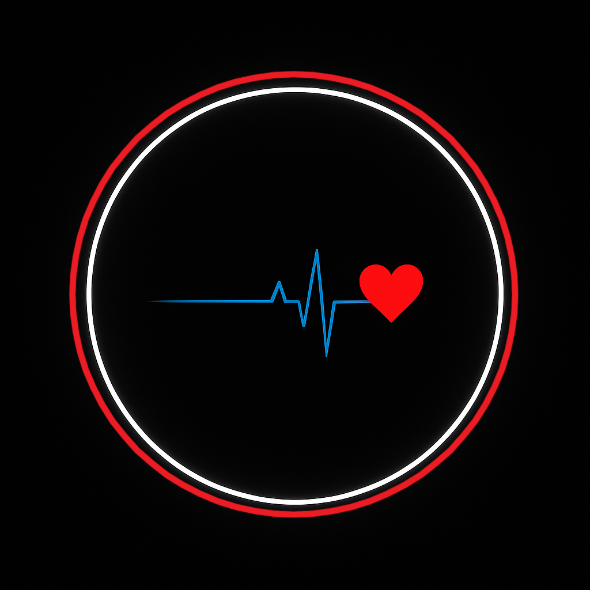

diff --git a/README.md b/README.md
index 127a63f62bf1813fef722cc42a379888189ef0ba..0eb91c90b5df99abfdd61481b3a5968d570352f9 100644
--- a/README.md
+++ b/README.md
@@ -1,57 +1,131 @@
-#  Monitoramento Cardíaco com ESP32
-## Monitor de Batimentos Cardíacos ❤️
+# Monitoramento Cardíaco com ESP32
+
+Sistema de monitoramento cardiovascular com **ESP32** e sensor **MAX30100/MAX30102** para leitura de sinais fisiológicos, com exibição em interface web.
 
 
 
-Projeto de IoT que realiza a **leitura de batimentos cardíacos (BPM)** e **oxigenação sanguínea (SpO2)** utilizando um ESP32 com sensor MAX30100/30102, exibindo os dados via **interface web responsiva**.
+---
+
+## 📌 Visão Geral
+
+Este projeto tem como objetivo apoiar o acompanhamento de saúde cardiovascular por meio da coleta e visualização de dados em tempo real. A solução foi pensada para cenários de prototipagem acadêmica e evolução para monitoramento remoto.
+
+### Objetivos principais
+- Coletar dados de batimentos cardíacos (BPM) com ESP32 + MAX3010x.
+- Exibir os dados em interface web acessível pela rede local.
+- Organizar uma base para expansão com autenticação, histórico e integração em nuvem.
 
 ---
 
-## 🛠 Tecnologias Utilizadas
+## 🧱 Arquitetura da Solução
+
+A solução está organizada em três frentes principais:
 
-- ⚙️ **ESP32**
-- 📡 Wi-Fi embutido
-- 📊 Sensor de Pulso MAX30100/30102 ( Coletando dados neste protótipo)
-- 🌐 Interface Web com HTML, CSS e JavaScript
-- 📦 Servidor Web interno via `WebServer.h`
+- **Firmware embarcado (ESP32):** leitura de sensor e disponibilização de dados via servidor HTTP.
+- **Interface web:** visualização de indicadores em tempo real.
+- **Estrutura de integração/protótipos:** experimentos adicionais para evolução do produto.
 
 ---
-# 👀 Visão do produto
-**Para** pessoas que necessitam de monitoramento constante da saúde cardiovascular, **o** SystemBPM (Sistema de Batimento Cardíaco) **é uma** API destinada ao acompanhamento de ritmos cardíacos, **que** melhora a conscientização dos pacientes sobre sua saúde, auxiliando no monitoramento dos batimentos cardíacos e possibilitando atendimentos futuros.**Ao** contrário dos métodos convencionais, como as consultas presenciais em clínicas, **esse produto** facilita o atendimento de forma remota, tornando a coleta de dados mais ágil e eficiente.
+
+## 🛠️ Tecnologias Utilizadas
+
+- **ESP32**
+- **Sensor MAX30100/MAX30102**
+- **Wi-Fi embarcado**
+- **Servidor HTTP com `WebServer.h`**
+- **Frontend Web**
+  - HTML/CSS/JavaScript (versões de protótipo)
+  - React + Vite + TypeScript (estrutura moderna em `src/project`)
 
 ---
-## Colaborador
-Mateus @MateusRondon
+
+## 📁 Estrutura do Repositório
+
+```text
+.
+├── README.md
+├── src/
+│   ├── back-end/
+│   │   ├── Site_Batimento/
+│   │   │   └── Monitoramento_Web.cpp
+│   │   └── sensor_batimentos.ino
+│   ├── front-end/
+│   │   ├── batimento-cardiaco/
+│   │   ├── Tela_assets/
+│   │   └── testes/
+│   └── project/
+│       ├── package.json
+│       └── src/
+├── Integracao-Web/
+└── Artigo_Projeto/
+```
+
+> Observação: o repositório contém variações e experimentos de implementação. Para evolução web moderna, priorize `src/project`.
+
 ---
-## Artigo Do Projeto
-[Artigo Sobre Batimento Cardiaco](Artigo_Projeto/Mateus.pdf)
 
+## ▶️ Como Executar
+
+### 1) Firmware (ESP32)
+1. Abra o sketch/arquivo de firmware no Arduino IDE ou PlatformIO.
+2. Ajuste SSID e senha Wi-Fi no código antes de gravar.
+3. Faça upload para o ESP32.
+4. Abra o Serial Monitor e identifique o IP atribuído.
+5. Acesse esse IP no navegador para visualizar os dados.
+
+### 2) Frontend React (opcional)
+No diretório `src/project`:
+
+```bash
+npm install
+npm run dev
+```
+
+A aplicação estará disponível localmente (porta definida pelo Vite).
 
 ---
-## 🔁 Fluxo de Funcionamento
+
+## 🔄 Fluxo de Funcionamento
 
 ```mermaid
 flowchart TD
-  
-    A[Início do Setup] --> B[Inicializa Serial e Wi-Fi]
-    B --> C[Conecta ao Wi-Fi]
-    C --> D[Inicia o Servidor Web]
-    D --> E[Define Rotas HTTP: /, /bpm, etc]
-    E --> F[Loop Principal]
-
-    F --> G{Leitura do Sensor < 50?}
-    G -- Não --> H[Zera BPM, SpO2 e tempo]
-    G -- Sim --> I[Marca dedo presente / Atualiza tempo]
-    I --> J{Dedo presente?}
-    J -- Não --> I[Loop até encontrar dedo]
-    J -- Sim --> K[Coleta Dados BPM entre 60-100]
-    K --> L[Coleta Dados SpO2 entre 90-100%]
-    H --> M[Exibe no Serial Monitor]
-    L --> M
-    M --> N[Responde rota /bpm com JSON]
-    M --> O[Responde rota /spo2 com JSON]
-    M --> P[Exibe dados na interface Web site]
-    P --> Q[Envia dados para o Firebase]
-    Q --> R[Confirmação de envio no console]
+    A[Inicialização] --> B[Configura Serial e Wi-Fi]
+    B --> C[Conecta à rede]
+    C --> D[Inicia servidor HTTP]
+    D --> E[Loop principal de leitura]
+    E --> F{Dedo detectado?}
+    F -- Sim --> G[Calcula BPM]
+    F -- Não --> H[Zera/aguarda nova leitura]
+    G --> I[Atualiza resposta de dados]
+    H --> I
+    I --> J[Interface web consulta endpoints]
+    J --> K[Exibição em tempo real]
+```
+
+---
+
+## 🚀 Possíveis Evoluções
+
+- Persistência de histórico em banco de dados.
+- Alertas para anomalias de BPM/SpO₂.
+- Dashboard clínico com perfil de pacientes.
+- Integração segura com APIs em nuvem.
+- Melhorias de calibração e robustez do sinal.
+
+---
+
+## 👨‍💻 Colaborador
+
+- **Mateus** — [@MateusRondon](https://github.com/MateusRondon)
+
+---
+
+## 📚 Artigo do Projeto
+
+- [Artigo sobre Batimento Cardíaco](Artigo_Projeto/Mateus.pdf)
+
+---
 
+## 📄 Licença
 
+Defina aqui a licença do projeto (ex.: MIT, Apache-2.0) para uso e distribuição.
